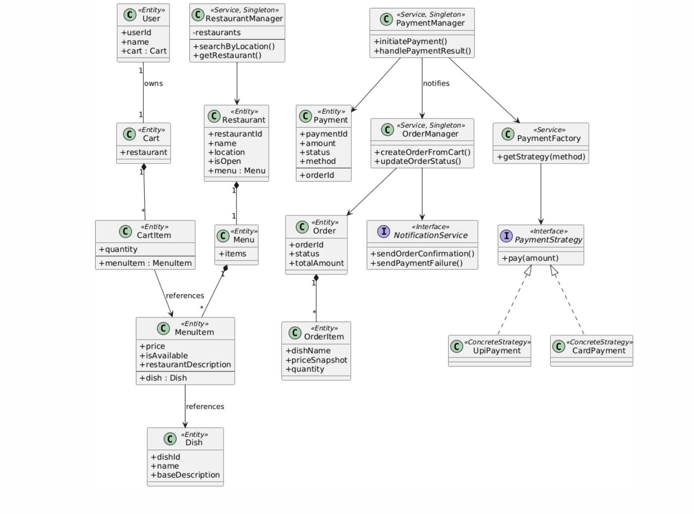

# Food Delivery System – Low Level Design (LLD)

---

## 1. Problem Statement (Starting Point)

> **Design a food delivery system similar to Swiggy / Zomato.**

This is approached as a **Low Level Design interview problem**, not as a full production system.

The expectation is:
- correct domain modeling
- clean object-oriented design
- clear responsibility separation
- ability to reason about trade-offs and scope

---

## 2. Assumptions & Constraints

### Explicit Assumptions
- Payment system already exists (3rd party)
- Notification system already exists (3rd party)
- No database design required
- No APIs / frameworks required
- Single process, in-memory objects
- Focus is on **core business logic**

### Interview Constraints
- Limited time (≈45–60 minutes)
- Not all real-world features can be designed
- Scope must be **intentionally narrowed**

---

## 3. First Design Question – What are the “views”?

### Question
What perspectives exist in a real food delivery system?

Possible answers:
- User
- Restaurant
- Delivery Partner
- Admin

### Key Realization
These are **perspectives**, not **domain objects**.

> Views should **not** appear in a class diagram.

### Decision
We do **not** design views.  
We design **domain entities and aggregates**.

---

## 4. Scope Decision – Which perspective to design?

### Question
If asked to “design the food delivery system”, should we design:
- user view
- restaurant view
- delivery partner view
- admin view

### Decision
👉 **Only the User-centric flow is designed.**

### Reasoning
- User flow drives core business logic:
  - restaurant discovery
  - menu browsing
  - cart
  - checkout
  - payment
- Other perspectives can be added later **without changing core entities**

This keeps the design focused and realistic for an interview.

---

## 5. Core Modeling Principle Used

> **Design around ownership and lifecycle, not screens.**

Key questions asked repeatedly:
- Who owns this object?
- Can it exist independently?
- Is it mutable or immutable?
- Who is allowed to modify it?

---

## 6. Restaurant Modeling

### Question
What fundamentally defines a restaurant?

### Decision
`Restaurant` is an **Entity**.

### Why?
- Has a stable identity
- Exists independently
- Owns its menu
- Has operational state (open/closed)

### Key Attributes
- restaurantId
- name
- location (used for search)
- open/close status
- menu

### Important Rule
> Restaurant does **not** expose menu mutation directly.

All access goes through a manager.

---

## 7. Dish vs MenuItem (Critical Design Evolution)

### Question
Why not just use `MenuItem` everywhere?
Why introduce `Dish` at all?

### Observations
- Same food can appear in multiple restaurants
- Price, availability, description vary per restaurant

### Final Decision
👉 **Dish and MenuItem are separate.**

| Concept | Responsibility |
|------|---------------|
| Dish | Conceptual food item |
| MenuItem | Restaurant-specific offering |

### Result
- MenuItem references Dish
- Dish identity is shared
- MenuItem controls price & availability

Dish lifecycle is **acknowledged conceptually**, not implemented.

---

## 8. Menu as an Aggregate

### Question
Should Restaurant directly store MenuItems?

### Decision
👉 Introduce a `Menu` aggregate.

### Why?
- Keeps Restaurant lean
- Groups menu-related logic
- Improves future extensibility

---

## 9. Cart Design

### Key Questions
- Who owns the cart?
- Can cart contain items from multiple restaurants?
- Should cart auto-update prices?

### Decisions
- Cart is **owned by User**
- Cart contains items from **only one restaurant**
- Prices are live until checkout
- Final validation happens at order creation

---

## 10. Why CartItem Exists

### Question
Why not store MenuItem directly inside Cart?

### Answer
Cart needs:
- quantity
- pricing behavior
- future extensions

### Decision
👉 Introduce `CartItem` as a line-item abstraction.

---

## 11. Cart vs Order (Immutability Rule)

### Key Rule
> **Cart is mutable. Order is immutable.**

### Implication
- Order must snapshot:
  - dish name
  - price
  - quantity
- Order must not depend on live MenuItem

### Result
- `OrderItem` exists separately from `CartItem`

---

## 12. Order Creation & Payment Failure

### Question
Should an order exist if payment fails?

### Decision
👉 **Yes.**

### Why?
- Enables payment retry
- Preserves audit trail
- Allows user notifications

### Order States Considered
- CREATED
- PAYMENT_PENDING
- PAYMENT_FAILED
- CONFIRMED
- CANCELLED

---

## 13. Payment Responsibility Separation

### Question
Who updates order status on payment result?

### Decision
- PaymentManager executes payment
- OrderManager owns order lifecycle
- PaymentManager **notifies**, never mutates Order directly

### Important Rule
> Payment system must not know restaurant state.

---

## 14. Restaurant Closed During Payment Retry

### Question
What if restaurant closes after order creation?

### Decision
- Retry is blocked
- Order stays in PAYMENT_FAILED
- User is notified

Payment is **not attempted** when restaurant is closed.

---

## 15. Why Managers Exist

### RestaurantManager
- Central access point
- Search and retrieval
- Prevents direct exposure

### OrderManager
- Creates orders from cart
- Owns order lifecycle
- Triggers notifications

### PaymentManager
- Initiates payment
- Handles retries
- Communicates results

All managers are **Singletons**.

---

## 16. Design Patterns Used

### Strategy Pattern
- Used for payment methods
- Enables extension without modification

### Factory Pattern
- Chooses correct payment strategy
- Removes conditional logic from core flow

---

## 17. Notification System

### Assumption
Notification system exists externally.

### Design Choice
- Modeled as an interface
- Triggered after order/payment events
- No internal implementation

---

## 18. Out of Scope (Intentionally)

- Delivery partner flow
- Admin controls
- Inventory management
- Database design
- APIs / frameworks

These can be added **without changing the core design**.

---

## Final Note

This design prioritizes:
- correctness over completeness
- reasoning over implementation
- clean ownership boundaries

It is structured to demonstrate **LLD thinking**, not code volume.
